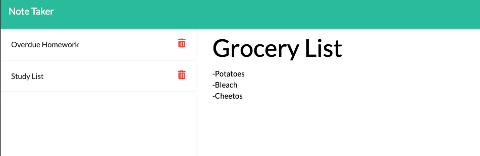

# Note Taker App

## Description

This is a note taker app that has been deployed through Heroku. It saves data to a JSON database file so information will persist.

## Table of Contents

\*[Usage](#usage)

\*[Contributing](#contributing)

\*[Questions](#questions)

##Usage

Save tasks, thoughts, or anything you want as long as it's text! This is a very basic app that took a lot of effort.

## Contributing

To contribute please submit a PR.

## Questions

If you have any questions about the repo, open an issue or contact me directly at emartizzle2185@me.com.
You can find more of my work at E-Martinez77
